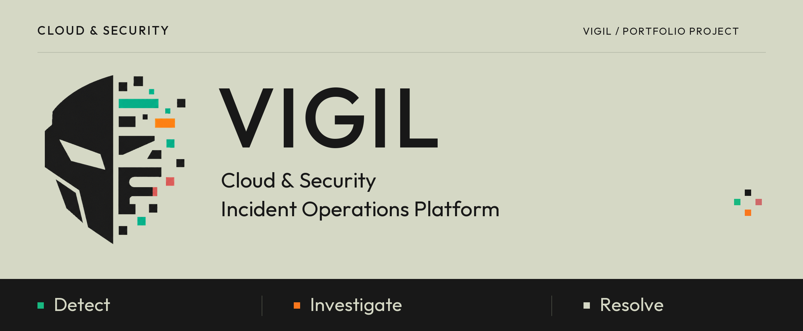
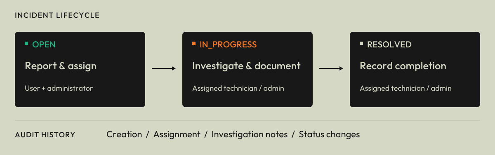
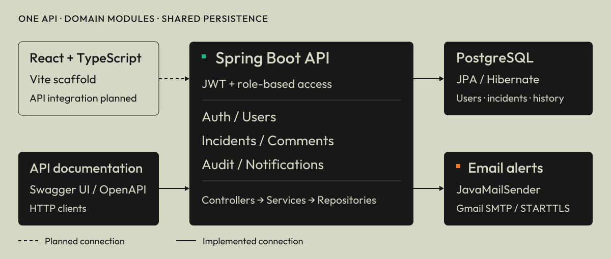

<p align="center">
  
</p>

<p align="center">
  <a href="#overview">Overview</a> ·
  <a href="#workflow">Workflow</a> ·
  <a href="#security">Security</a> ·
  <a href="#architecture">Architecture</a> ·
  <a href="#getting-started">Run locally</a> ·
  <a href="#roadmap">Roadmap</a>
</p>

Vigil is a full-stack portfolio project in active development. The Spring Boot API handles incident operations. The React frontend is still the Vite starter, with the product UI yet to be built.

<a name="overview"></a>
## 

Vigil tracks cloud and security incidents from the initial report through assignment, investigation, and resolution. Its backend keeps incident details, investigation notes, audit history, and email alerts together, with access controlled by role.

Incidents currently enter the system through the API. Automated cloud telemetry ingestion and a web dashboard connected to the API are planned.

<a name="why-vigil"></a>
## 

When an incident is reported, responders need to know its severity and who owns the investigation. They also need a record of what has been tried and how the issue was resolved.

In Vigil, severity and category help with triage. Administrators assign technicians to take ownership of incidents, and participants keep investigation notes in comments. The audit history records who took each action and when. A participant's role and relationship to the incident determine what they can access.

<a name="workflow"></a>
## 



| Stage | What happens | Who acts |
| --- | --- | --- |
| `OPEN` | Create an incident with severity and category. An enabled technician must be assigned before work starts. | Users or administrators create incidents; administrators assign them. |
| `IN_PROGRESS` | Start the investigation and add notes. Work can start only from `OPEN`. | The assigned technician or an administrator starts work. Authorized participants can comment. |
| `RESOLVED` | Finish the investigation and record the resolution timestamp. Only an incident in `IN_PROGRESS` can be resolved. | The assigned technician or an administrator resolves the incident. |

The API writes an audit entry when an incident is created, assigned, started, or resolved, and when someone adds a comment. Creating a `CRITICAL` incident sends an email alert to enabled administrators. A new `HIGH` incident also triggers an alert if there are at least three active `HIGH` incidents (`OPEN` or `IN_PROGRESS`).

`CLOSED` exists in the domain enum and entity. A close endpoint has yet to be added, so the API workflow ends at resolution.

<a name="features"></a>
## 

| Capability | Current implementation |
| --- | --- |
| Authentication | Registration, login, signed JWT Bearer tokens, and BCrypt password hashing. |
| Role-based access | `USER`, `TECHNICIAN`, and `ADMIN` permissions, with incident-level ownership checks. |
| Incident operations | Create, retrieve, assign, start, and resolve incidents, with checks on status changes. |
| Triage | Four severity levels: `LOW`, `MEDIUM`, `HIGH`, `CRITICAL`. Categories: security, network, application, cloud, database, and other. |
| Investigation notes | Paginated comments, with access limited to the creator, assigned technician, and administrators. |
| Audit history | Incident timelines and an audit feed for administrators, with the actor, action, and timestamps. |
| Operational queries | Filter incidents by status, severity, and category; search titles; paginate and sort results. Technicians see their assigned incidents. |
| Email alerts | Alerts for critical incidents and the active high-severity threshold, sent through JavaMailSender. |
| User administration | Paginated user listing, role changes, account disabling, and re-enabling. |
| API documentation | Swagger UI and OpenAPI with a Bearer authentication scheme. |
| Tests | JUnit and Mockito service tests, authentication controller tests, and an application-context smoke test. |

### Collaboration model

| Role | Scope |
| --- | --- |
| `USER` | Creates incidents and reads their own incidents, comments, and audit history. The incident list endpoint is reserved for technicians and administrators. |
| `TECHNICIAN` | Lists and reads assigned incidents, adds notes, and starts or resolves assigned work. |
| `ADMIN` | Creates and lists incidents, assigns technicians, manages workflow, reads audit history, and manages user accounts. |

<a name="security"></a>
## 

The API checks both the token and the current user record:

- HS256 JWT Bearer tokens contain the user ID, email subject, and role. The decoder checks the signature, issuer, and token timestamps. Tokens have a configured lifetime of 60 minutes.
- BCrypt hashes passwords. Disabled accounts cannot log in.
- Spring Security method rules enforce role permissions. Services also check incident ownership and assignment.
- For each request authenticated with a JWT, the decoder loads the user and checks that the account is enabled, the user ID matches, and the token role matches the current database role.
- Disabling an account blocks its existing tokens while it remains disabled. After a role change, the next authenticated request rejects any token with the old role. The user must log in again to get a token for the new role.

Registration always creates a `USER`. Clients cannot choose a privileged role. Authentication endpoints and API documentation are public; the rest of the API requires authentication.

The API has no permanent token revocation list. An otherwise valid, unexpired token can become usable again if the account is re-enabled or its previous role is restored. Dedicated token revocation and refresh-token handling are planned.

<a name="architecture"></a>
## 



Vigil is a modular monolith: one Spring Boot application split into domain packages, all using the same PostgreSQL database. Controllers define HTTP endpoints. Services handle the workflow and authorization, while Spring Data JPA repositories and Hibernate manage persistence.

| Part | Responsibility |
| --- | --- |
| `vigil-web/` | React, TypeScript, and Vite scaffold. Product screens and API integration are planned. |
| `vigil-api/` | REST API with `auth`, `user`, `incident`, `comment`, `audit`, and `notification` packages, plus shared configuration and error handling. |
| PostgreSQL | Persists users, incidents, comments, and audit records. |
| Email integration | JavaMailSender sends alerts through Gmail SMTP with STARTTLS. It sends synchronously during incident creation and logs send failures. |
| API tooling | springdoc generates Swagger UI and OpenAPI from the backend. |

<a name="tech-stack"></a>
## 

| Layer | Technologies in the repository |
| --- | --- |
| Backend | Java 25 · Spring Boot 4.1.1 · Spring Web MVC · Bean Validation |
| Security | Spring Security · OAuth2 Resource Server / JOSE · BCrypt |
| Persistence | Spring Data JPA · Hibernate · PostgreSQL |
| Notifications | Spring Mail / JavaMailSender |
| Documentation | springdoc-openapi 3.1.1 · Swagger UI |
| Backend testing | JUnit · Mockito · Spring Boot test support · MockMvc |
| Frontend | React 19 · TypeScript 6 · Vite 8 · React Compiler |
| Tooling | Maven Wrapper · npm · Oxlint |

## API documentation

When the backend is running locally, you can use:

- [Swagger UI](http://localhost:8080/swagger-ui/index.html) to explore routes and authorize requests with a token returned by login.
- [OpenAPI JSON](http://localhost:8080/v3/api-docs) for the generated API contract.
- [HTTP examples](vigil-api/requests.http) for registration requests in an IDE HTTP client. Both examples create `USER` accounts, despite their ADMIN/TECHNICIAN labels.

| Routes | Purpose |
| --- | --- |
| `/api/auth/register`, `/api/auth/login` | Registration and token issuance. |
| `/api/incidents`, `/api/incidents/{id}` | Incident creation, listing, and retrieval. |
| `/api/incidents/{id}/assign`, `/start`, `/resolve` | Assignment and lifecycle actions. |
| `/api/incidents/{incidentId}/comments` | Investigation notes. |
| `/api/incidents/{incidentId}/audit`, `/api/audit` | Per-incident history and the administrator audit feed. |
| `/api/users`, `/api/users/{id}/role`, `/disable`, `/enable` | Administrator user operations. |

To list incidents, use `status`, `severity`, `category`, or `search` to filter the results, and `page`, `size`, and `sort` for pagination and ordering. An administrator or technician can make a request like this:

```http
GET /api/incidents?status=OPEN&severity=HIGH&page=0&size=20&sort=createdAt,desc
Authorization: Bearer <token-from-login>
```

<a name="getting-started"></a>
## 

### Prerequisites

- JDK 25.
- A running PostgreSQL instance and `psql` for the setup examples.
- Node.js 22.12 or newer and npm. The locked Vite version also supports Node.js 20.19+ within the 20.x line.
- Gmail SMTP credentials for email delivery.

The Maven Wrapper is included, so you don't need to install Maven separately. Start the following steps from the repository root.

### 1. Prepare PostgreSQL

Connect as a PostgreSQL administrator:

```sh
psql -U postgres
```

Create the application user and database, replacing the password placeholder with your local password:

```sql
CREATE USER vigil_api_user WITH PASSWORD 'replace-with-your-local-password';
CREATE DATABASE vigil_db OWNER vigil_api_user;
```

The defaults in [application.yaml](vigil-api/src/main/resources/application.yaml) use `localhost:5432`, database `vigil_db`, and user `vigil_api_user`. Hibernate creates or updates the local schema at startup (`ddl-auto: update`). Versioned migrations are planned.

### 2. Configure and start the backend

```sh
cd vigil-api
```

Copy the environment example to your local configuration file:

```powershell
# Windows PowerShell
Copy-Item .env.example .env
```

```sh
# macOS / Linux
cp .env.example .env
```

Set the values described in [Environment variables](#environment-variables), then run:

```powershell
# Windows PowerShell
.\mvnw.cmd spring-boot:run
```

```sh
# macOS / Linux
sh ./mvnw spring-boot:run
```

The API runs at `http://localhost:8080`. Run it from `vigil-api/` so it can find `.env` through the relative import.

### 3. Create the first local administrator

In Swagger UI, register an account through `POST /api/auth/register` with `email`, `password`, `firstName`, and `lastName`. The account starts as a `USER`. The project has no administrator seed or bootstrap endpoint yet.

Connect to your local development database as its owner, then promote the account you just registered:

```sh
psql -h localhost -U vigil_api_user -d vigil_db
```

```sql
UPDATE users SET role = 'ADMIN' WHERE email = 'admin@example.com';
```

Use the registered account's email in place of the example, then log in through `POST /api/auth/login`. Enter the returned token in Swagger's **Authorize** dialog. This administrator can promote other registered accounts to `TECHNICIAN` through `/api/users/{id}/role` and assign incidents to them.

### 4. Run the frontend scaffold

Open another terminal at the repository root:

```sh
cd vigil-web
npm ci
npm run dev
```

Open the URL Vite prints, usually `http://localhost:5173`. You'll see the starter UI. API integration, authentication screens, and the incident workspace are planned.

## Environment variables

Spring imports `vigil-api/.env` as a properties file. Write entries as plain `KEY=value` pairs and keep your local values out of version control. The checked-in [.env.example](vigil-api/.env.example) contains placeholders:

```dotenv
DB_PASSWORD=your_database_password
JWT_SECRET=replace-with-a-random-secret-at-least-32-bytes
MAIL_USERNAME=your_email@email.com
MAIL_APP_PASSWORD=your_app_password
```

| Variable | Purpose |
| --- | --- |
| `DB_PASSWORD` | Password for the PostgreSQL application user. |
| `JWT_SECRET` | A randomly generated signing secret of at least 32 bytes for HS256. The example text is a placeholder. |
| `MAIL_USERNAME` | Gmail account used as the SMTP username and sender. |
| `MAIL_APP_PASSWORD` | Mail account app password used for SMTP authentication. |

Set the database URL and username directly in `application.yaml`; the configuration has no `DB_URL` or `DB_USERNAME` placeholders. SMTP uses `smtp.gmail.com:587`, with authentication and STARTTLS enabled. The frontend has no environment variables or API base URL settings yet.

## Testing

Backend tests cover authentication, incident services, comment permissions, audit access, and notification rules. Run the suite from `vigil-api/`:

```powershell
# Windows PowerShell
.\mvnw.cmd test
```

```sh
# macOS / Linux
sh ./mvnw test
```

The smoke test loads the full application context and needs the configured PostgreSQL database and environment values. To run just the service and controller tests without that context:

```powershell
# Windows PowerShell
.\mvnw.cmd "-Dtest=*ServiceTest,AuthControllerTests" test
```

```sh
# macOS / Linux
sh ./mvnw '-Dtest=*ServiceTest,AuthControllerTests' test
```

In `vigil-web/`, run the linter and check the production build:

```sh
npm run lint
npm run build
```

A frontend test suite and end-to-end incident scenarios are planned.

<a name="roadmap"></a>
## Roadmap

- [ ] Build and connect the React incident workspace, authentication flow, and role-specific views.
- [ ] Add dashboard summaries for incident volume, severity, ownership, and resolution trends.
- [ ] Finish the incident lifecycle with a close operation that checks state transitions.
- [ ] Add controlled administrator bootstrapping and versioned database migrations.
- [ ] Expand security and workflow integration tests; add frontend and end-to-end tests.
- [ ] Send notifications asynchronously, with retries.
- [ ] Add incident report / PDF export.
- [ ] Prepare deployment configuration, CI verification, and application monitoring.
